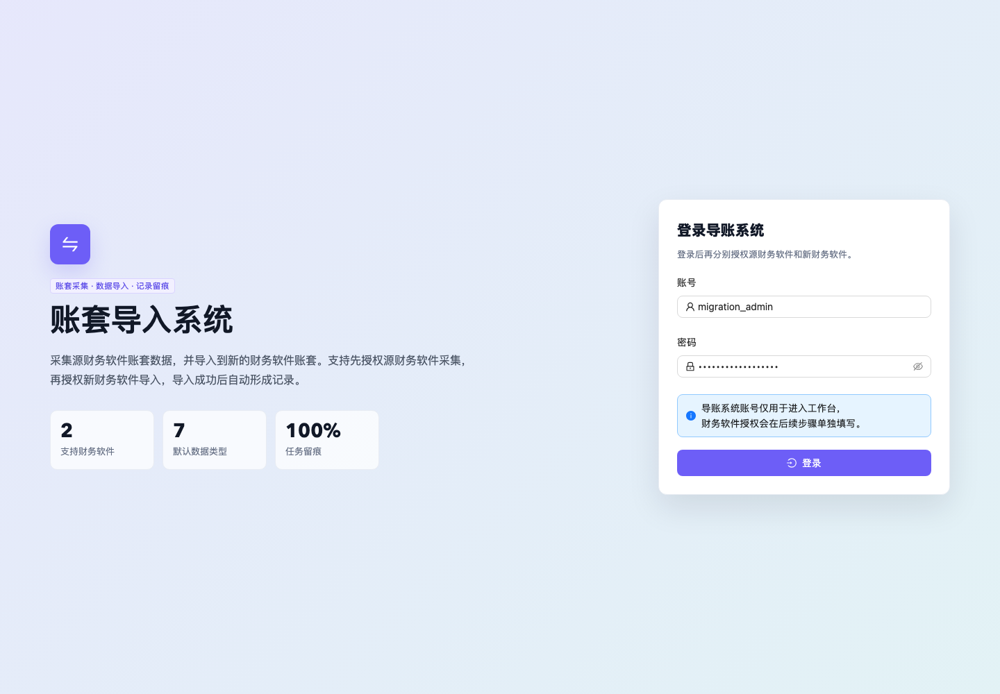
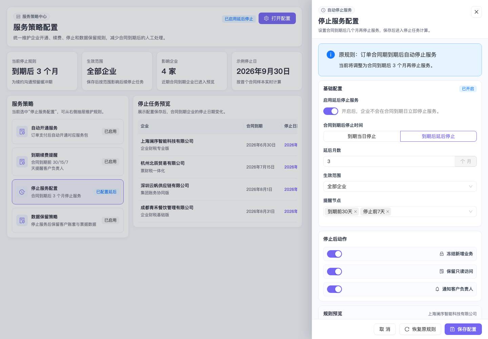
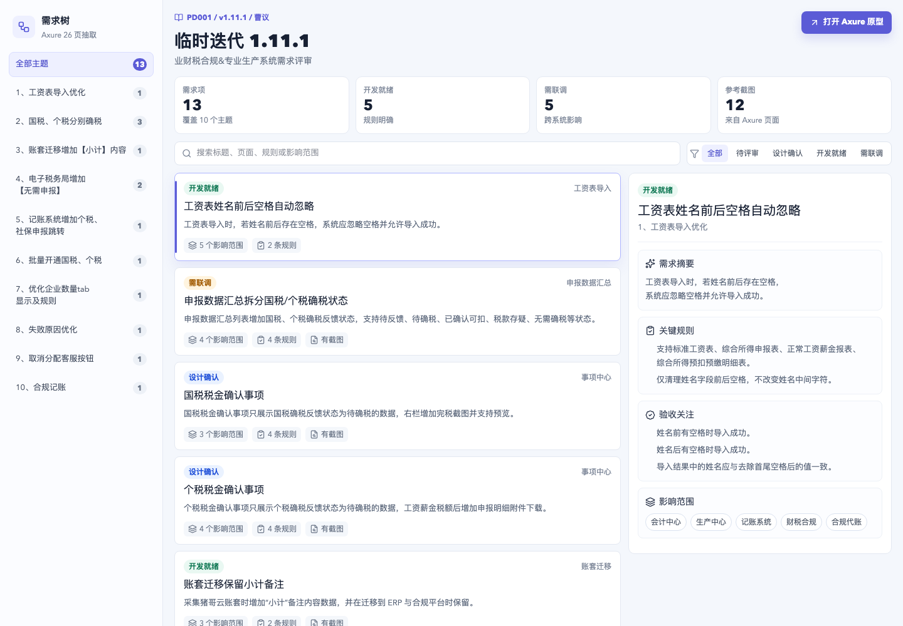

# AI 使用反馈周报（2026-06-12）

## 一、使用工具与 Skill

**使用工具：**

- Codex / ChatGPT：用于项目资料阅读、需求提炼、原型规格整理、代码实现与周报归档。
- Axhub Make 项目工作流：用于将需求文档、`spec.md`、原型代码、截图证据组织成可提交的作业包。
- Playwright：用于打开本地原型页面并生成截图验收证据。
- 本地文件与项目检索：用于核对本周新增原型、文档、自动化工作流与上周评分反馈。

**使用 Skill / 规范：**

- `AGENTS.md`：项目总工作流，约束“需求 → spec → 原型 → 验收”的交付方式。
- `rules/design-guide.md`：用于设计阶段的信息架构、视觉规范与 `spec.md` 产出。
- `rules/development-guide.md`：用于原型目录结构、文件头、依赖、验收流程。
- `服务商设计规范`：用于 B 端工作台、配置抽屉、任务列表等高密度业务界面。
- `playwright`：用于页面截图和浏览器级验收。

## 二、结合上周评分后的改进点

上周反馈综合得分为 **83 / 100**，主要建议包括：

1. **作业包中需要包含可复用流程资产**：上周虽然提到了 `AGENTS.md` 和 `rules/`，但提交包里没有包含，导致工作流证据不完整。
2. **原型不能只停留在静态展示**：需要补充真实交互逻辑、状态变化和验收截图。
3. **结构化交付需要补充前后对比**：说明 AI 工作流实际带来的提速和质量提升。

本周针对以上反馈做了三类改进：

- 在周报和可点击版交付包中补充 `AGENTS.md`、`rules/design-guide.md`、`rules/development-guide.md` 等规范证据。
- 对本周新增原型补充可访问截图，证明页面可以在本地真实运行。
- 将“产出是什么”升级为“产出解决了什么问题、如何复用、下一步如何优化”。

## 三、关键 Prompt / 核心思路

请 AI 先阅读上周评分反馈，再结合本周项目中的新增原型、需求文档、自动化工作流和验收截图，生成一份更符合评分标准的 AI 使用反馈周报。周报需要突出：

- 真实可打开的项目成果；
- 可复用的 `AGENTS.md` / `rules` 工作流资产；
- 本周新增的自动化项目；
- 与上周反馈相比的改进；
- 可供团队复用的 Prompt、Skill 和工作流经验。

## 四、最终产出

### 1. 导账 / 账套迁移自动化原型

本周重点产出之一是 **账套导入系统** 原型，用于解决财务软件切换时的账套迁移问题。用户先登录导账系统，再分别授权源财务软件和目标财务软件，系统通过异步任务完成采集、校验、数据选择和导入记录留痕。

**核心能力：**

- 导账系统登录，不再按账号所属系统区分入口。
- 支持源财务软件授权、异步采集、目标财务软件授权、导入方式选择。
- 支持“跳过已创建账套企业”和“覆盖已创建账套企业”两种导入策略。
- 支持按财务数据、基础资料、智能记账、其他数据进行选择。
- 右侧保留导入记录、导入策略、审计入口和导出入口。

**相关文件：**

- `src/prototypes/ledger-migration/prd.md`
- `src/prototypes/ledger-migration/spec.md`
- `src/prototypes/ledger-migration/index.tsx`
- `src/prototypes/ledger-migration/style.css`
- `dist/prototypes/ledger-migration.html`
- `src/docs/interactive-prototypes-2026-06-12/ledger-migration-interactive.html`

**截图证据：**

**可点击交互 HTML：**

- `dist/prototypes/ledger-migration.html`
- `src/docs/interactive-prototypes-2026-06-12/ledger-migration-interactive.html`（独立可点击版，推荐提交）

### 2. 停止服务配置抽屉原型

本周新增 **停止服务配置** 原型，用于企业服务后台配置“合同到期后延后停止服务”的规则，覆盖续约沟通、宽限期管理和客户数据保留场景。

**核心能力：**

- 从服务策略列表打开右侧配置抽屉。
- 支持启停延后停止服务规则。
- 支持配置延后月数、生效范围、提醒节点和停止后动作。
- 基于示例合同到期日实时预览停止服务日期。
- 展示受影响企业列表，帮助运营确认配置影响范围。
- 保存后触发 `onSaveStopServiceConfig`，可接入后续配置保存逻辑。

**相关文件：**

- `src/prototypes/stop-service-config/spec.md`
- `src/prototypes/stop-service-config/index.tsx`
- `src/prototypes/stop-service-config/style.css`
- `dist/prototypes/stop-service-config.html`
- `src/docs/interactive-prototypes-2026-06-12/stop-service-config-interactive.html`

**截图证据：**

**可点击交互 HTML：**

- `dist/prototypes/stop-service-config.html`
- `src/docs/interactive-prototypes-2026-06-12/stop-service-config-interactive.html`（独立可点击版，推荐提交）

### 3. 临时迭代 1.11.1 需求评审工作台

本周继续沉淀 **临时迭代 1.11.1 需求评审工作台**，将 Axure 原型资料整理成可搜索、可筛选、可逐项评审的需求工作台，帮助产品、研发、测试和业务验收人员快速理解需求范围。

**核心能力：**

- 按 10 个迭代主题组织需求项。
- 支持按标题、页面、规则、影响范围搜索。
- 支持按待评审、设计确认、开发就绪、需联调筛选。
- 右侧详情区展示需求摘要、关键规则、验收关注和影响范围。
- 保留原始 Axure 链接，方便追溯来源。

**相关文件：**

- `src/prototypes/temp-iteration-1111/spec.md`
- `src/prototypes/temp-iteration-1111/index.tsx`
- `src/prototypes/temp-iteration-1111/style.css`
- `dist/prototypes/temp-iteration-1111.html`
- `src/docs/interactive-prototypes-2026-06-12/temp-iteration-1111-interactive.html`

**截图证据：**

**可点击交互 HTML：**

- `dist/prototypes/temp-iteration-1111.html`
- `src/docs/interactive-prototypes-2026-06-12/temp-iteration-1111-interactive.html`（独立可点击版，推荐提交）

### 4. 财税系统切换访谈纪要与需求提炼

本周还产出了一份可点击版访谈纪要，将新旧财税系统切换中的业务问题、痛点和需求方向整理为结构化页面，便于团队评审和后续拆解。

**相关文件：**

- `src/docs/财税系统切换访谈纪要_需求提炼_可点击版.html`

### 5. 自动化项目：博客索引自动化工作流

本周将自动化项目也纳入周报说明。该自动化项目围绕博客内容上线后的 SEO 索引监控，自动完成变更检测、URL 准备度校验、IndexNow 提交、Search Console 数据查询、索引状态报告和低流量 / 停滞问题提醒。

**自动化能力：**

- 生产发布完成后自动检测新增博客 URL。
- 自动校验页面是否具备 canonical、sitemap、JSON-LD、OG 元数据等 SEO 基础条件。
- 自动提交 IndexNow，并重新提交 sitemap 到 Google Search Console。
- 在 T+1 / T+3 / T+7 / T+14 窗口自动复查索引状态。
- 自动生成 `docs/blog-indexing-status.md` 和 `docs/blog-traffic-digest.md`。
- 通过 bot PR 沉淀索引状态和流量摘要。
- 对无法自动解决的问题开 GitHub issue，交给人工处理内容或 SEO 问题。

**相关文件：**

- `vendor/open-design/docs/blog-indexing-automation.md`

### 6. Obsidian 第二大脑应用

本周将 Obsidian 作为 AI 工作流的“输入与复盘层”纳入周报重点。它不是单纯存放笔记，而是用于承接 AI 使用过程中的 Prompt、PRD 检查清单、任务分层判断和复盘结论。

**当前知识库结构：**

- `/Inbox`：存放每日捕获的原始素材和简报输入。
- `/Notes`：存放外部文章、课程、剪藏和学习材料。
- `/Ideas`：沉淀原创判断、方法论、复盘和阶段性认知。
- `/Projects`：计划用于承接真实财税项目样本，目前也是后续需要加强的部分。

**本周相关笔记：**

- `/Users/caoyi/Documents/第二大脑/AGENTS.md`
- `/Users/caoyi/Documents/第二大脑/Ideas/2026-06-03 - 从 PRD 到 AI 执行的任务分层判断.md`
- `/Users/caoyi/Documents/第二大脑/Ideas/2026-06-03 - 财税产品 PRD 检查清单（初版）.md`
- `/Users/caoyi/Documents/第二大脑/Ideas/2026-06-11 - 输入链路中断比总结能力更值得优先修复.md`
- `/Users/caoyi/Documents/第二大脑/Inbox/brief-2026-06-12.md`

**实际价值：**

- 把“Prompt / Skill / MCP / Agent”的概念学习，转成“目标、流程、数据口径、异常分支、验收标准”的任务分层判断。
- 把 PRD 写作经验转成财税产品检查清单，后续可直接用于需求评审和 AI 原型生成前置检查。
- 通过每日认知简报发现当前最大问题不是总结能力不足，而是 `/Inbox` 和 `/Projects` 缺少持续进入的真实业务样本。
- 为本周 Skill 包沉淀提供依据：稳定、重复、可校验的流程应优先沉淀为 Skill，而不是每次重新写 Prompt。

### 7. 可复用 Skill 包

根据本周工作方式，已沉淀一个可复用 Skill 包：`skills/ai-weekly-evidence-report/`。

该 Skill 用于后续重复生成“AI 使用反馈周报 / 作业包 / 可点击证据包”，尤其适合需要同时包含：

- 上周评分反馈；
- 本周项目文件；
- 自动化任务；
- Obsidian 知识库复盘；
- 可点击交互原型 HTML；
- 截图证据；
- 可复用 Prompt 与经验沉淀。

**相关文件：**

- `skills/ai-weekly-evidence-report/SKILL.md`
- `skills/ai-weekly-evidence-report/references/report-outline.md`
- `skills/ai-weekly-evidence-report/references/evidence-package-checklist.md`

## 五、效果评估

### 预期目标

希望 AI 帮助解决三个问题：

1. 把业务需求快速转成能评审的原型和规格文档。
2. 把可复用的工作流、规范和自动化项目放进作业包，避免只有结果没有过程证据。
3. 针对上周评分反馈，补齐“真实成果、交互证据、验收截图、方法沉淀”。

### 实际结果

本周实际形成了更完整的交付链路：

- **需求层**：形成导账系统 PRD、停止服务配置规格、临时迭代需求评审规格。
- **原型层**：新增导账系统、停止服务配置、临时迭代评审工作台三个可运行原型，并生成可点击交互 HTML。
- **证据层**：补充 Playwright 截图，证明页面可以真实打开。
- **流程层**：在周报中明确引用 `AGENTS.md`、`rules/design-guide.md`、`rules/development-guide.md`。
- **自动化层**：补充博客索引自动化项目，体现 AI 不只做页面，也能沉淀可持续运行的工作流。
- **知识沉淀层**：把 Obsidian 第二大脑作为输入、复盘和 Skill 化判断的来源。
- **复用层**：新增 `ai-weekly-evidence-report` Skill 包，降低后续周报和作业包整理成本。

### 结果与预期差距

整体比上周更接近评分要求，但仍有两个待优化点：

1. 项目自带的 `check-app-ready` 验收脚本本周出现误判：日志里 TypeScript 实际退出码为 0，但脚本把 `pnpm` 输出中的提示内容识别为错误。后续需要优化验收脚本，避免把工具提示当作构建失败。
2. 导账系统截图停留在登录页，但本周已补充可点击交互 HTML，后续可以继续补充“登录后任务列表 / 异步采集 / 导入确认 / 导入成功”等关键状态截图，让交互证据更完整。
3. Obsidian 中已经沉淀了方法论和 PRD 检查清单，但 `/Projects` 真实项目样本仍不足，后续需要把导账、停止服务配置等真实项目回写到 Obsidian 项目区。

## 六、前后对比

| 对比项 | 上周状态 | 本周改进 |
| --- | --- | --- |
| 工作流证据 | 提到了 `AGENTS.md` 和 `rules/`，但作业包未包含 | 周报明确列出并打包关键规范文件 |
| 原型证据 | 以规格文档和 HTML 为主，截图证据不足 | 补充 3 张 Playwright 验收截图 |
| 交互深度 | 部分原型偏静态 | 新增导账异步任务、配置抽屉、筛选评审等交互场景，并生成可点击 HTML |
| 自动化沉淀 | 主要体现页面和文档生成 | 增加博客索引自动化工作流说明，并把导账系统作为业务自动化原型 |
| Obsidian 应用 | 未作为作业重点呈现 | 补充第二大脑结构、PRD 检查清单、任务分层判断和输入链路复盘 |
| Skill 复用 | 有方法总结，但未形成独立 Skill | 新增 `ai-weekly-evidence-report` Skill 包 |
| 反思方法 | 有总结，但和评分项关联不够强 | 按上周评分建议逐项回应 |

## 七、经验沉淀

### 有效 Prompt

> 先读取上周评分反馈，再读取本周新增项目文件，按“评分改进点 → 本周产出 → 验收证据 → 经验沉淀”的结构生成周报，并把 AGENTS/rules、截图和关键文档放进可点击作业包。

### 推荐工作流

1. 先让 AI 阅读 `AGENTS.md` 和 `rules/`，确认项目交付规范。
2. 再让 AI 阅读需求资料或 Axure 原型，提炼 PRD / `spec.md`。
3. 根据 `spec.md` 实现原型，补齐交互、状态和事件。
4. 用浏览器截图或验收脚本生成证据。
5. 构建可点击交互 HTML，把原型 HTML、JS 和运行依赖一起放进提交包。
6. 最后把周报、截图、规范文件、Obsidian 证据和关键产物打包成可点击版，避免别人打不开本地路径。

### 常见问题与解决方案

- **问题：本地路径发给别人打不开。**  
  解决：生成可点击版 HTML 作业包，把 Markdown、截图和规范文件复制进包内，用相对链接访问。

- **问题：AI 只生成页面，没有说明工作流。**  
  解决：在 Prompt 里要求明确引用 `AGENTS.md`、`rules/design-guide.md`、`rules/development-guide.md`，并说明每个规范如何影响产出。

- **问题：原型容易偏静态。**  
  解决：在 `spec.md` 里提前定义事件、动作、变量、状态流转，再让 AI 实现。

- **问题：自动化项目容易写成“功能介绍”。**  
  解决：按触发器、任务、产物、失败兜底、人工介入点来写，更像真实可运行的自动化方案。

- **问题：Obsidian 容易只变成资料仓库。**  
  解决：把笔记分成 Inbox、Notes、Ideas、Projects 四层；周报只引用能支撑本周判断的笔记，并明确“当前证据不足”的边界。

- **问题：每周重复整理周报成本高。**  
  解决：沉淀 `ai-weekly-evidence-report` Skill，把读取评分反馈、扫描项目变更、生成截图、打包可点击 HTML 的流程固定下来。

## 八、本周可提交附件

- 周报正文：`src/docs/AI使用反馈周报_2026-06-12.md`
- 截图目录：`src/docs/assets/ai-weekly-2026-06-12/`
- 可点击交互原型 HTML：
  - `src/docs/interactive-prototypes-2026-06-12/ledger-migration-interactive.html`
  - `src/docs/interactive-prototypes-2026-06-12/stop-service-config-interactive.html`
  - `src/docs/interactive-prototypes-2026-06-12/temp-iteration-1111-interactive.html`
- 导账系统原型：`src/prototypes/ledger-migration/`
- 停止服务配置原型：`src/prototypes/stop-service-config/`
- 临时迭代评审工作台：`src/prototypes/temp-iteration-1111/`
- 自动化项目说明：`vendor/open-design/docs/blog-indexing-automation.md`
- 可复用 Skill 包：`skills/ai-weekly-evidence-report/`
