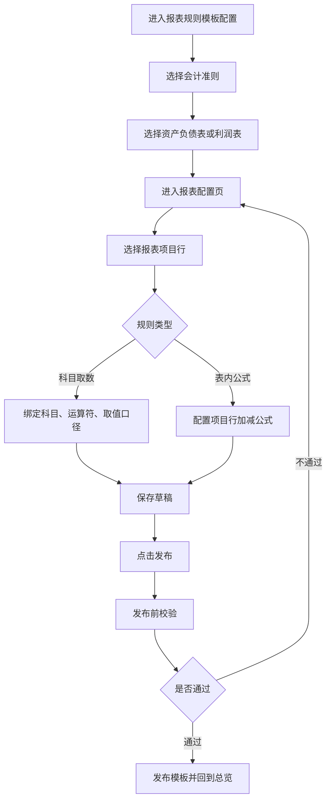

# 后台报表规则模板配置 PRD

## 0. 文档信息

- 版本：`v1.0`
- 状态：`Draft`
- 目标用户：后台会计
- 关联原型：`src/prototypes/report-rule-configuration`
- 需求范围：新建客户账套的初始报表规则模板配置

---

## 1. 背景与目标

### 1.1 背景问题

后台需要为客户新建账套预置财务报表规则。如果缺少统一模板，会计需要在每个账套里重复配置报表项目、科目取数、表内公式和校验规则，容易出现科目漏绑、报表不平、初始规则口径不一致等问题。

### 1.2 业务目标

1. 后台会计可以按会计准则维护标准化报表初始模板。
2. 新建客户账套时自动带入对应准则下的资产负债表、利润表规则。
3. 发布前明确校验报表平衡、科目漏绑、重复科目、公式引用和影响范围。
4. 发布后的模板只影响未来新建客户账套，不影响已有客户账套。

### 1.3 非目标

1. 本期不做行业维度模板。
2. 本期不做发布审批、版本回滚和权限模型。
3. 本期不覆盖客户账套内的个性化规则管理。
4. 本期不配置报表列级规则，年初、本期、上期等列取数由系统代码规则固定。

---

## 2. 用户角色

| 角色 | 核心诉求 | 本期权限假设 |
| --- | --- | --- |
| 后台会计 | 维护准则对应的初始报表规则模板 | 查看、编辑、发布 |
| 客户账套会计 | 在自己账套内使用或修改初始化规则 | 不在本后台原型范围内 |

---

## 3. MVP 范围

| 模块 | 本期范围 |
| --- | --- |
| 会计准则 | 企业会计准则、小企业会计准则 |
| 报表类型 | 资产负债表、利润表 |
| 配置颗粒度 | 报表项目行 |
| 取数规则 | 一个项目可绑定多个科目；每个科目支持搜索、`+ / -` 运算符、余额/借方余额/贷方余额/发生额等取值口径 |
| 公式规则 | 合计行支持表内项目相加减 |
| 校验规则 | 报表不平、科目漏绑、重复科目绑定、公式循环引用、影响范围确认 |
| 发布规则 | 会计直接发布；发布后回到总览；仅影响未来新建账套 |

---

## 4. 核心用户故事

### US-01 按准则查看模板配置

**As a** 后台会计  
**I want to** 在总览页选择企业会计准则或小企业会计准则  
**So that** 我能查看该准则下已配置的报表模板数量、规则状态和待发布变更

**验收标准**

1. Given 后台会计进入页面  
   When 选择某一会计准则  
   Then 页面展示该准则下的资产负债表和利润表模板。

2. Given 某准则存在待发布变更  
   When 查看总览指标  
   Then 可看到已配置报表数、规则数量、待发布变更和最近发布时间。

### US-02 配置报表项目行

**As a** 后台会计  
**I want to** 打开某张报表的配置页并选择项目行  
**So that** 我能维护该项目的科目取数或表内公式

**验收标准**

1. Given 会计点击报表“配置”  
   When 进入配置页  
   Then 左侧展示接近真实报表的表样，右侧展示当前项目行配置。

2. Given 当前报表为资产负债表  
   When 进入配置页  
   Then 表样采用资产/负债和所有者权益左右结构。

3. Given 当前报表为利润表  
   When 进入配置页  
   Then 表样采用纵向项目结构，列名保留“本期金额 / 上期金额”。

### US-03 绑定科目取数规则

**As a** 后台会计  
**I want to** 给普通项目行绑定一个或多个科目  
**So that** 系统能在新建账套时按模板生成项目取数规则

**验收标准**

1. Given 当前项目行为普通项目行  
   When 会计新增科目规则  
   Then 可搜索选择科目、选择 `+ / -` 运算符、选择取值口径。

2. Given 会计修改科目规则  
   When 保存草稿  
   Then 表样中的该项目行同步展示最新取值范围。

### US-04 设置表内公式

**As a** 后台会计  
**I want to** 给合计行配置表内项目加减公式  
**So that** 系统能校验报表项目之间的勾稽关系

**验收标准**

1. Given 当前项目行为合计校验行  
   When 会计查看科目取值规则  
   Then 系统展示表内公式，不要求绑定科目。

2. Given 公式存在循环引用  
   When 发布前校验  
   Then 系统提示风险并阻断发布。

### US-05 发布模板

**As a** 后台会计  
**I want to** 在配置完成后发布模板  
**So that** 未来新建客户账套可以使用最新初始报表规则

**验收标准**

1. Given 会计点击发布配置  
   When 发布前校验弹窗打开  
   Then 展示报表平衡、科目漏绑、重复科目、公式引用和影响范围提示。

2. Given 校验通过  
   When 会计确认发布  
   Then 模板发布成功，待发布变更清零，并回到总览页。

3. Given 模板发布成功  
   When 新客户账套按该准则创建  
   Then 系统带入该准则下已启用报表的初始规则。

---

## 5. 业务流程

---

## 6. 领域模型

| 实体 | 关键字段 | 说明 |
| --- | --- | --- |
| AccountingStandard | id, name, version | 会计准则 |
| ReportTemplate | id, standard_id, name, status, enabled | 报表模板 |
| ReportItem | id, report_id, name, line_no, row_type | 报表项目行 |
| SubjectRule | item_id, subject_code, operator, value_rule | 科目取数规则 |
| FormulaRule | item_id, expression, referenced_items | 表内公式规则 |
| PublishCheck | type, status, message | 发布前校验结果 |
| TemplateVersion | version, published_at, published_by | 模板发布记录 |

---

## 7. 页面设计要求

### 7.1 总览页

必须展示：

- 准则列表：企业会计准则、小企业会计准则
- 指标：已配置报表数、规则数、待发布变更、最近发布时间
- 报表矩阵：启用状态、报表名称、周期、状态、关联规则、操作
- 校验预览：发布就绪度、科目覆盖、风险提示
- 当前报表真实预览

### 7.2 配置页

必须展示：

- 返回总览、新增行、删除行、保存表样、发布配置
- 真实表样区：资产负债表左右结构，利润表纵向结构
- 当前行摘要：项目名称、规则类型、数据来源、公式预览
- 行项目配置表单：项目名称、报表区域、行次、科目取值规则、取值范围、行类型、取值规则类型、取值公式、数据来源

---

## 8. 发布校验规则

| 校验项 | 触发时机 | 通过条件 | 不通过处理 |
| --- | --- | --- | --- |
| 报表平衡 | 点击发布 | 资产总计等于负债和所有者权益总计 | 阻断发布 |
| 科目漏绑 | 点击发布 | 普通项目行至少绑定一个科目 | 阻断发布 |
| 重复科目 | 点击发布 | 同一报表项目内无重复科目 | 提示并要求修正 |
| 公式循环引用 | 点击发布 | 表内公式不存在循环引用 | 阻断发布 |
| 影响范围确认 | 点击发布 | 明确仅影响未来新建账套 | 展示确认提示 |

---

## 9. 客户侧规则关系

后台模板仅作为新建账套时的初始化来源。客户进入自己账套后，可以在账套范围内自定义修改报表规则。客户侧修改不回写后台模板，也不受后台后续发布覆盖。
