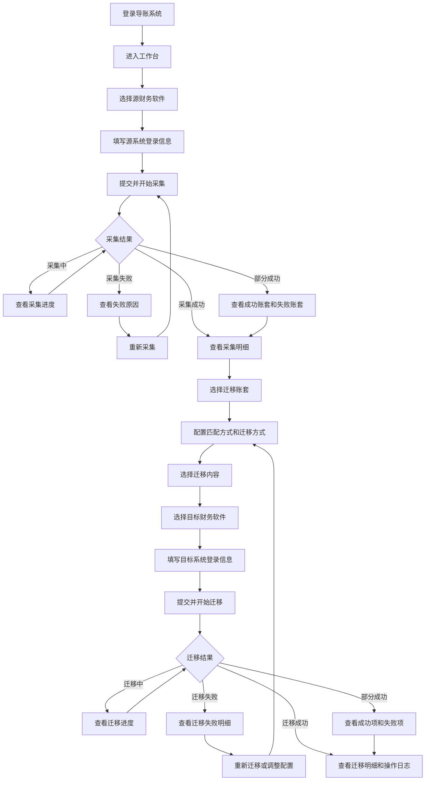
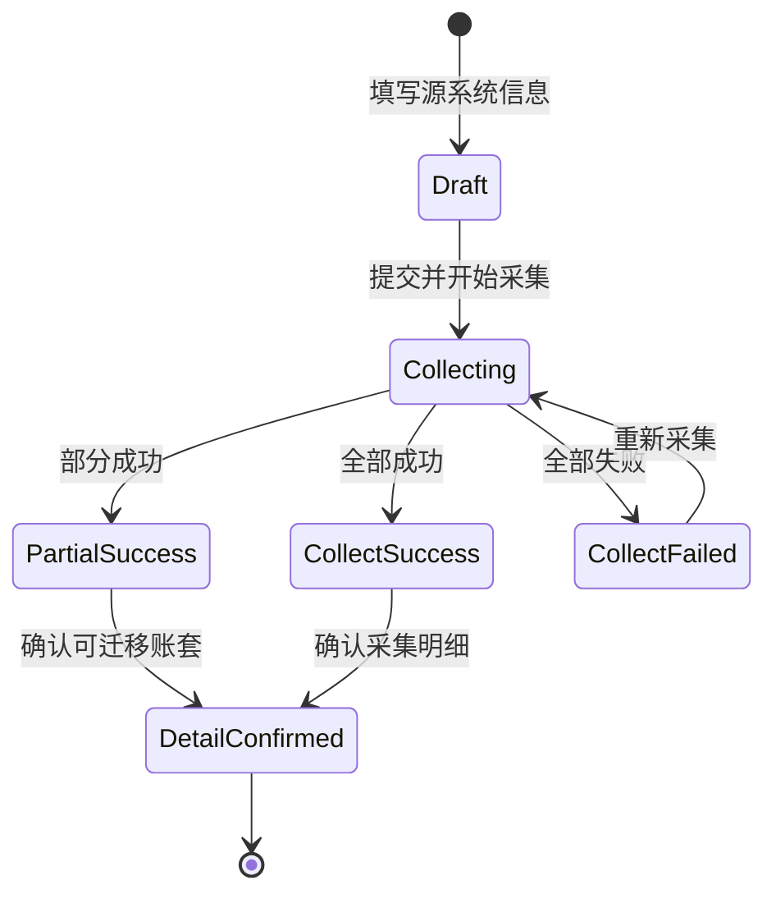
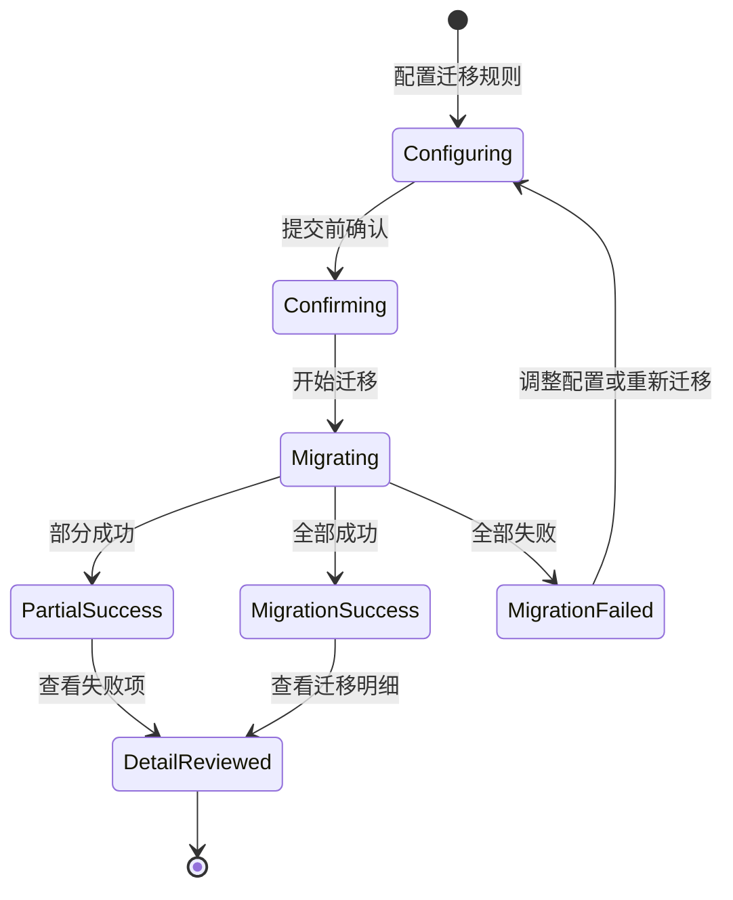

# 猪哥云自助导账系统产品设计流程

## 0. 文档信息

- 版本：`v1.0`
- 状态：`Draft`
- 日期：`2026-06-16`
- 资料来源：`/Users/caoyi/Downloads/猪哥云自助导账系统.html`
- 关联范围：登录、工作台、采集任务、采集明细、迁移配置、迁移进度、迁移明细

## 1. 背景与目标

### 1.1 背景问题

导图已定义自助导账系统的主干能力：登录、工作台、发起采集任务、采集任务记录、迁移进度。但导图中存在几类流程断点：

1. 采集成功后如何进入账套确认和迁移配置未完全串联。
2. 采集明细、选择迁移账套、迁移新财务软件、提交迁移、迁移明细等节点较分散。
3. 失败、部分成功、重新采集、重新迁移等异常处理缺少完整闭环。
4. 覆盖已有账套属于高风险操作，需要明确风险提示和二次确认。

### 1.2 产品目标

1. 帮助用户从源财务软件采集账套数据，并迁移到目标财务软件。
2. 将采集任务和迁移任务设计为可追踪、可重试、可审计的后台处理记录。
3. 在迁移前提供账套匹配、迁移方式、迁移内容、目标软件授权等配置能力。
4. 对失败和部分成功结果提供可解释原因、影响范围和下一步操作。

### 1.3 非目标

1. 本期不设计真实第三方软件授权协议和接口细节。
2. 本期不覆盖所有财务软件字段，仅保留“按软件动态展示登录字段”的扩展机制。
3. 本期不处理真实数据清洗规则，仅定义产品层面的异常提示和用户决策点。

## 2. 用户角色与核心诉求

| 角色 | 核心诉求 | 使用频率 |
| --- | --- | --- |
| 企业用户 | 自助完成账套采集和迁移，减少人工导账成本 | 中 |
| 服务商运营 | 代客户处理批量导账，快速定位失败原因 | 高 |
| 财税顾问 | 确认账套、会计准则、纳税性质和数据范围是否正确 | 中 |
| 系统管理员 | 查看任务日志、授权记录和异常明细 | 中 |

## 3. 完善后的端到端流程



## 4. 页面地图

```text
猪哥云自助导账系统
├── 登录页
│   ├── 账号
│   ├── 密码
│   └── 登录成功后进入工作台
├── 工作台
│   ├── 导账记录
│   ├── 采集任务入口
│   ├── 采集任务状态概览
│   └── 迁移任务状态概览
├── 新建采集任务
│   ├── 选择源财务软件
│   │   ├── 猪哥云
│   │   ├── 财税合规 AI 服务系统
│   │   ├── 亿企赢
│   │   └── 更多软件
│   ├── 商户/服务商名称
│   ├── 账号
│   ├── 密码
│   └── 提交并开始采集
├── 采集任务记录
│   ├── 采集中
│   ├── 采集失败
│   ├── 采集成功
│   ├── 部分成功
│   └── 重新采集
├── 采集明细
│   ├── 账套名称
│   ├── 统一社会信用代码
│   ├── 纳税性质
│   ├── 会计准则
│   └── 异常提示
├── 迁移配置
│   ├── 选择迁移的账套
│   ├── 选择匹配方式
│   │   ├── 按账套名称
│   │   ├── 按统一社会信用代码
│   │   └── 按账套名称 + 统一社会信用代码
│   ├── 选择迁移方式
│   │   ├── 覆盖已创建账套的企业
│   │   └── 跳过已创建账套的企业
│   ├── 选择迁移内容
│   │   ├── 记账单据
│   │   ├── 财务数据
│   │   ├── 其他
│   │   ├── 库存
│   │   └── 资产
│   └── 目标财务软件授权
└── 迁移进度
    ├── 迁移中
    ├── 迁移失败
    ├── 迁移成功
    ├── 部分成功
    └── 迁移明细
```

## 5. 核心用户故事

### US-01 登录并进入工作台

**As a** 企业用户  
**I want to** 使用导账系统账号登录  
**So that** 我可以查看历史导账记录并发起新的导账任务

**验收标准**

1. Given 用户输入账号和密码，When 点击登录，Then 系统进入工作台。
2. Given 登录失败，When 系统返回错误，Then 页面展示明确错误原因并允许用户重新输入。

### US-02 发起源系统采集任务

**As a** 企业用户  
**I want to** 选择源财务软件并填写登录信息  
**So that** 系统可以采集源软件下的账套数据

**验收标准**

1. Given 用户选择源财务软件，When 软件类型变化，Then 表单展示该软件需要的登录字段。
2. Given 用户提交采集，When 表单校验通过，Then 系统创建采集记录并进入采集结果页面。

### US-03 查看采集结果并处理异常

**As a** 服务商运营  
**I want to** 查看采集状态、失败原因和成功账套  
**So that** 我可以判断是否继续迁移或重新采集

**验收标准**

1. Given 任务为采集中，When 用户查看任务，Then 页面展示进度和当前阶段。
2. Given 任务为采集失败，When 用户查看详情，Then 页面展示失败原因并提供重新采集入口。
3. Given 任务为部分成功，When 用户查看详情，Then 页面分别展示成功账套和失败账套。

### US-04 确认采集明细

**As a** 财税顾问  
**I want to** 查看账套名称、统一社会信用代码、纳税性质和会计准则  
**So that** 我可以确认哪些账套适合迁移

**验收标准**

1. Given 采集成功，When 用户进入采集明细，Then 页面展示账套列表和关键字段。
2. Given 账套字段缺失或重复，When 用户查看列表，Then 页面标记异常并提示影响。

### US-05 配置迁移规则

**As a** 企业用户  
**I want to** 选择账套、匹配方式、迁移方式和迁移内容  
**So that** 我可以控制数据迁移范围和覆盖策略

**验收标准**

1. Given 用户选择覆盖已创建账套，When 点击提交迁移，Then 系统展示二次确认和风险提示。
2. Given 用户未选择任何账套或迁移内容，When 点击提交迁移，Then 系统阻止提交并提示补全选择。

### US-06 跟踪迁移进度和结果

**As a** 服务商运营  
**I want to** 查看迁移进度、失败明细和操作日志  
**So that** 我可以完成交付并追溯异常

**验收标准**

1. Given 任务为迁移中，When 用户查看任务，Then 页面展示当前迁移阶段和进度。
2. Given 任务为迁移失败或部分成功，When 用户查看详情，Then 页面展示失败账套、失败数据项、失败原因和下一步操作。
3. Given 任务为迁移成功，When 用户查看详情，Then 页面展示迁移明细、操作日志和导出入口。

## 6. 关键数据对象

| 对象 | 关键字段 | 说明 |
| --- | --- | --- |
| 用户 | `user_id`, `name`, `role` | 当前登录用户 |
| 财务软件 | `software_id`, `name`, `auth_fields` | 源/目标软件及其登录字段 |
| 采集任务 | `collect_task_id`, `source_software`, `merchant_name`, `status`, `progress`, `error_reason` | 源系统采集任务 |
| 账套 | `ledger_id`, `ledger_name`, `company_name`, `credit_code`, `tax_type`, `accounting_standard`, `status` | 被采集和迁移的核心对象 |
| 迁移配置 | `match_mode`, `migration_mode`, `selected_ledgers`, `selected_contents`, `target_software` | 迁移前的用户选择 |
| 迁移任务 | `migration_task_id`, `status`, `progress`, `success_count`, `failed_count`, `error_reason` | 目标系统迁移任务 |
| 操作日志 | `log_id`, `operator`, `action`, `time`, `result` | 任务审计与追溯 |

## 7. 状态生命周期

### 7.1 采集任务状态



### 7.2 迁移任务状态



## 8. 关键交互设计

### 8.1 工作台

- 默认展示导账记录，突出“发起采集任务”主操作。
- 支持按任务状态筛选：采集中、待迁移、迁移中、失败、部分成功、成功。
- 每条记录展示源软件、目标软件、商户/服务商、账套数量、更新时间和下一步操作。

### 8.2 财务软件授权

- 源软件和目标软件都采用“先选软件，再展示登录字段”的模式。
- 默认字段包括商户/服务商名称、账号、密码。
- 预留验证码、企业选择、授权确认等扩展字段。

### 8.3 采集明细

- 账套列表支持搜索、筛选、批量选择。
- 异常账套必须明确原因，例如统一社会信用代码缺失、账套名称重复、会计准则不支持。
- 部分成功场景下，默认只勾选可迁移账套。

### 8.4 迁移配置

- 匹配方式建议默认选“账套名称 + 统一社会信用代码”，准确性最高。
- 迁移方式建议默认选“跳过已创建账套的企业”，降低误覆盖风险。
- 选择“覆盖已创建账套的企业”时必须展示二次确认。
- 迁移内容按导图分组：记账单据、财务数据、其他、库存、资产。

### 8.5 迁移进度与明细

- 迁移中展示阶段进度，例如目标授权校验、账套匹配、数据写入、结果校验。
- 失败或部分成功展示到账套和数据项维度，提供重新迁移、调整配置、导出失败清单。
- 成功后展示迁移明细、操作日志、导出入口。

## 9. 异常与风控

| 场景 | 用户提示 | 推荐操作 |
| --- | --- | --- |
| 源系统登录失败 | 账号、密码或商户/服务商信息不正确 | 修改授权信息后重新采集 |
| 源系统权限不足 | 当前账号无权访问部分账套 | 更换账号或联系管理员授权 |
| 采集部分成功 | 部分账套采集失败，成功账套可继续迁移 | 查看失败原因，决定是否继续 |
| 账套重复 | 目标系统可能已有同名账套 | 使用统一社会信用代码辅助匹配 |
| 统一社会信用代码缺失 | 无法准确匹配企业 | 手动确认或跳过该账套 |
| 覆盖已有账套 | 目标系统已有数据可能被更新 | 二次确认后执行 |
| 迁移部分成功 | 部分账套或数据项写入失败 | 导出失败清单，重新迁移失败项 |
| 迁移失败 | 目标系统授权、网络或数据校验失败 | 查看日志并调整配置 |

## 10. 页面落点建议

后续页面可按以下结构实现：

1. 登录页：账号密码登录。
2. 工作台首页：导账记录、状态筛选、发起采集任务。
3. 新建采集任务页：源财务软件选择和登录信息填写。
4. 采集任务记录页：采集状态、失败原因、重新采集。
5. 采集明细页：账套列表和异常确认。
6. 迁移配置页：账套、匹配方式、迁移方式、迁移内容、目标软件授权。
7. 迁移进度页：迁移状态、进度、部分成功/失败处理。
8. 迁移明细页：结果明细、操作日志、导出。

建议优先实现桌面端 B 端工作台形态，信息密度高于营销页，核心任务区强调流程推进、异常定位和批量操作。
